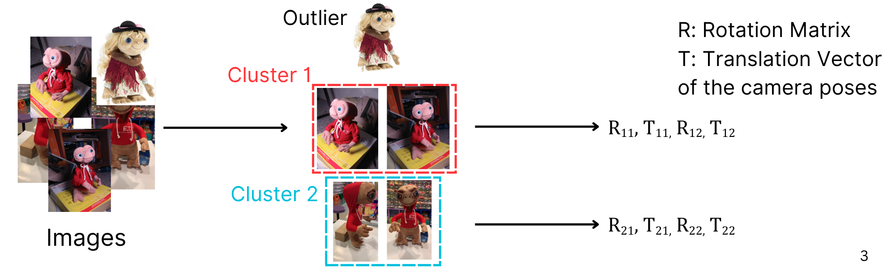
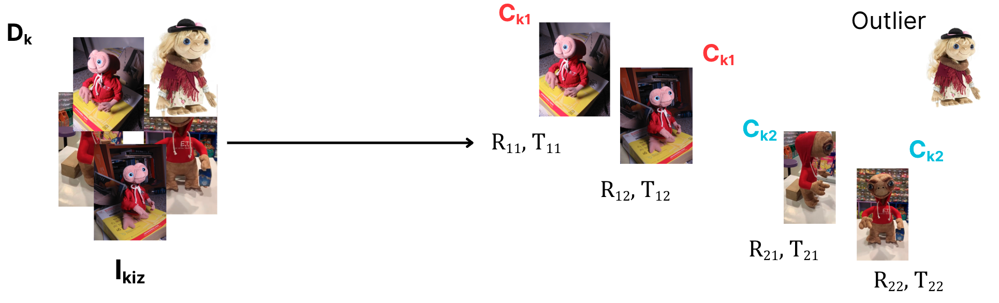
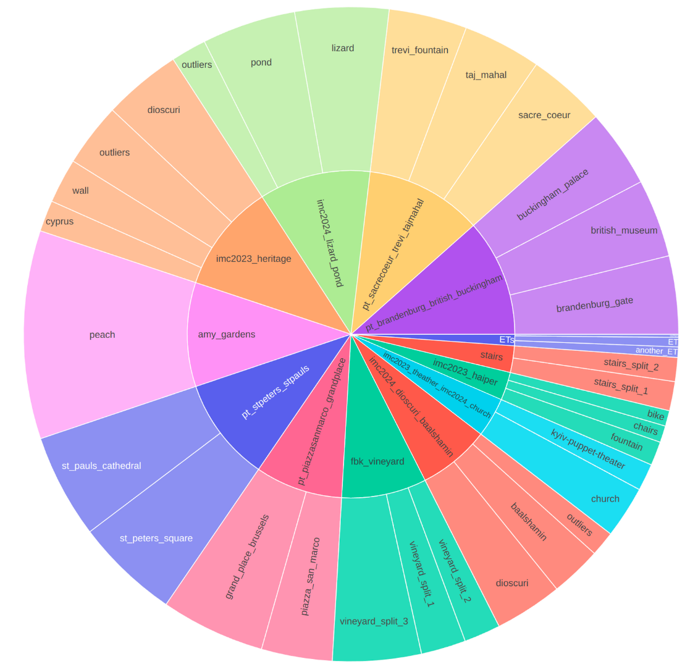
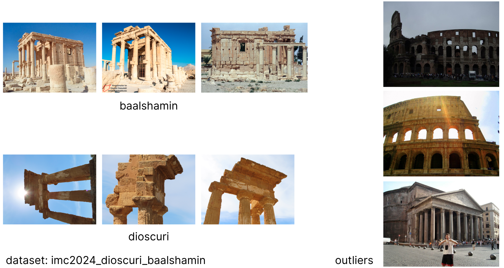
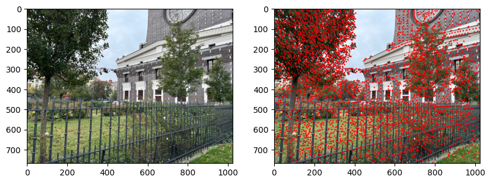
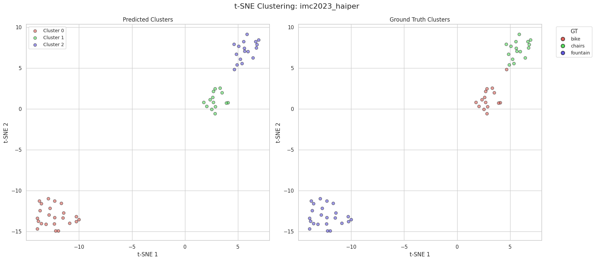
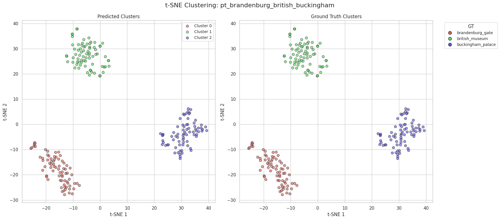
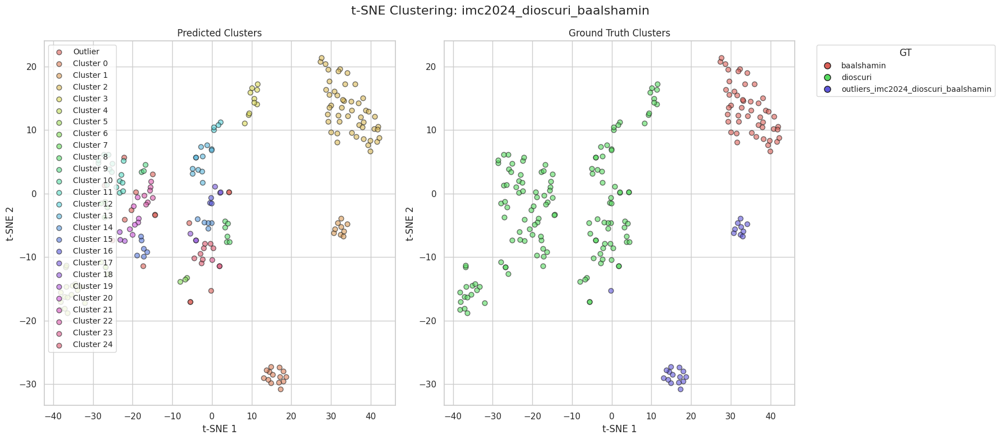
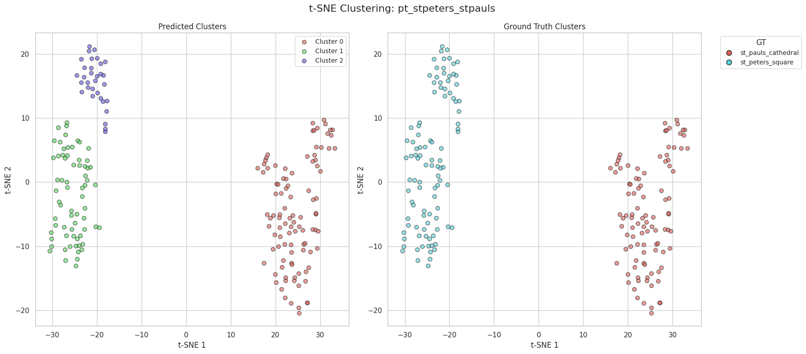
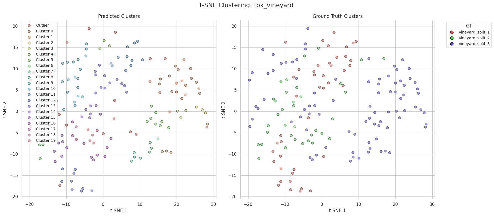

# Image Matching Challenge 2025
Farros Alferro (C4IM2502)

github repository: https://github.com/farrosalferro/Information_Technology_1

Please install the required packages to run the notebooks

```bash
conda create -n it1 python=3.10 -y # (if you use conda virtual environment)
pip install -r requirements.txt
mkdir data
mkdir notebooks/weights
```

Download the data from the [competition](https://www.kaggle.com/competitions/image-matching-challenge-2025/data) and put it under the `data` directory. To run `dino_clustering.ipynb`, please download the DINOv2 weight from Kaggle from this [link](https://www.kaggle.com/models/metaresearch/dinov2/PyTorch/base/1). Extract the weight and put it under `notebooks/weights` folder.

## Project Update 1

## What is Image Matching Challenge?
- Annual competition held by CVPR - Image Matching Workshop
  - Has been held since 2019
  - Conducted in Kaggle since 2022

- What do the participants do?
  - "Develop machine learning **algorithms** that can figure out which **images belong together** and use them to **reconstruct accurate 3D scenes**."



### In a More Formal Way
- Each set (training is given, test is hidden)
  - Consists of multiple dataset $D_k$.
  - Each dataset contains one or more scenes $S_{ki}$. Imagine this as a landmark/object pictures taken from different angles.
  - Each scene has some images $I_{kiz}$, this is the input of our model.
- We need to predict
  - The camera poses of each image ($R$ and $T$).
  - Cluster $C_{kj}$ where the image belongs to. If there is no cluster, identify it as "outlier".



## Metrics
### Mean Average Accuracy (mAA)
Measures **how accurate** our predicted camera poses with the ground truth camera poses. According to last year challenge, here is how mAA is calculated:

>Submissions are evaluated on the mean Average Accuracy (mAA) of the registered camera centers $\mathbf{C} = -\mathbf{R}^\top \mathbf{T}$. Given the set of cameras of a scene, parameterized by their rotation matrices $\mathbf{R}$ and translation vectors $\mathbf{T}$, and the hidden ground truth, we compute the best similarity transformation $\mathcal{T}$ (i.e., scale, rotation and translation altogether) that is able to register onto the ground truth the highest number of cameras starting from triplets of corresponding camera centers.

>A camera is registered if $\lVert \mathbf{C}_g - \mathcal{T}(\mathbf{C}) \rVert < t$, where $\mathbf{C}_g$ is the ground-truth camera center corresponding to $\mathbf{C}$ and $t$ is a given threshold. Using a RANSAC-like approach, all the possible ${N \choose 3}$ feasible similarity transformations $\mathcal{T}'$ that can be derived by the Horn's method on triplets of corresponding camera centers $(\mathbf{C}, \mathbf{C}_g)$ are verified *exhaustively*, where $N$ is the number of cameras in the scene. Each transformation $\mathcal{T}'$ is further *refined* into $\mathcal{T}''$ by registering again the camera centers by the Horn's method, but including at this time the previously registered cameras together with the initial triplets. The best model $\mathcal{T}$ among all $\mathcal{T}''$ with the highest number of registered cameras is finally returned.

>Assuming that $r_i$ is the percentage of cameras in a scene, excluding the original camera center triplets, successfully registered by $\mathcal{T}_i$ setting a threshold $t_i$, the mAA for that scene is computed by averaging $r_i$ among several thresholds $t_i$. The thresholds $t_i$ employed range from roughly 1 cm to 1 m according to the kind of scene. The final score is obtained by averaging the mAA among all the scenes in the dataset.

To summarize, our predicted camera poses are transformed to align with the closest ground truth camera configuration. A predicted pose is considered **registered** if its difference from the ground truth is smaller than a given threshold (multiple thresholds are used depending on the type of scene). A higher number of registered cameras indicates greater accuracy. The final accuracy is computed by averaging the results across all thresholds, hence the term mean Average Accuracy.

### Clustering Score
Measure **how similar** our **predicted clusters** with the true clusters. Here is the definition from the official website:

>The clustering score is given by number images of the cluster effectively belonging to the scene, divided by the cardinality of the cluster, i.e. $\frac{|\mathcal{S} \cap \mathcal{C}|}{|\mathcal{C}|}$. Each scene $S_{ki} \in D_k$ is *greedily* associated to the cluster $\mathbf{C}_{ki_{j}}$, among those provided by the user, that maximizes the *mean Average Accuracy* (*mAA*).

### Final Score

The combined score $S_k$ is the harmonic mean of the mAA and clustering scores. In this formulation, the mAA score is roughly equivalent to recall, and the clustering score to precision, and the final score is thus analogous to the standard F1 score. Finally, we average the results over the different datasets to obtain a single score.

## Exploratory Data Analysis (Train)

- For the training set, there are 13 datasets in total.
  - Varying from phototourism and historical preservation, natural environments, object-centric, etc.
  - There are 30 scenes with 'ouliers' scenes across 4 datasets.
  - 1945 images in total with average resolution of (1101, 982) and 122 outlier images.



Here are some examples from dataset `imc2024_dioscuri_baalshamin`



## Methods

### Baseline
The competition commitee published a minimum jupyter notebook that processes the input images and outputs the predictions. We can submit this notebook as our submission, however the score is pretty low (compared to the current top 100). The pipeline consists of the following steps:

1. [DINOv2](https://arxiv.org/abs/2304.07193) to find pairs of similar images. This is done by taking the normalized image embeddings, then the distances between all image embeddings are calculated and only keep those below a given threshold.
2. [ALIKED](https://arxiv.org/abs/2304.03608) to extract relevant keypoints and their descriptors. Alternatively, we can use more traditional method like SIFT.



3. [LightGlue](https://arxiv.org/abs/2306.13643) to find a good relationship between images in a pair. This model matches the keypoints and their descriptors between two images.
4. [RANSAC](https://web.archive.org/web/20230204054340/http://citeseerx.ist.psu.edu/viewdoc/download?doi=10.1.1.106.3035&rep=rep1&type=pdf) to remove outliers (not image outliers like the one described in the introduction, this one refers to image pairs that are redundant or noisy). It finds the best possible fundamental matrix $F$, then the matrix with maximum number of inliers is chosen.
5. Now that we have imilar image pairs with their matched keypoint descriptors, we construct the scene and obtain the camera positions using [COLMAP](https://openaccess.thecvf.com/content_cvpr_2016/papers/Schonberger_Structure-From-Motion_Revisited_CVPR_2016_paper.pdf). This algorithm offers an incremental reconstruction algorithm that starts from two pairs of images and continually adds more and more images to the scene, resulting in a reconstructed scene with camera information. Then the camera rotation and translation is used as submission. Furthermore, COLMAP comes with an outlier detection, so that images that don't align with the reconstructed scene will be classified as outlier.


The baseline method results in this performance on the training set:
- **imc2023_haiper**: score = 63.98% (mAA = 64.44%, clusterness = 63.53%)
- **imc2023_heritage**: score = 49.53% (mAA = 32.91%, clusterness = 100.00%)
- **imc2023_theather_imc2024_church**: score = 54.17% (mAA = 37.14%, clusterness = 100.00%)
- **imc2024_dioscuri_baalshamin**: score = 62.53% (mAA = 48.38%, clusterness = 88.37%)
- **imc2024_lizard_pond**: score = 64.85% (mAA = 47.99%, clusterness = 100.00%)
- **pt_brandenburg_british_buckingham**: score = 46.22% (mAA = 75.35%, clusterness = 33.33%)
- **pt_piazzasanmarco_grandplace**: score = 61.88% (mAA = 81.17%, clusterness = 50.00%)
- **pt_sacrecoeur_trevi_tajmahal**: score = 47.71% (mAA = 83.91%, clusterness = 33.33%)
- **pt_stpeters_stpauls**: score = 57.46% (mAA = 67.53%, clusterness = 50.00%)
- **amy_gardens**: score = 30.54% (mAA = 18.02%, clusterness = 100.00%)
- **fbk_vineyard**: score = 22.13% (mAA = 16.56%, clusterness = 33.33%)
- **ETs**: score = 31.67% (mAA = 25.00%, clusterness = 43.18%)
- **stairs**: score = 0.00% (mAA = 0.00%, clusterness = 50.00%)
- **Average over all datasets**: score = 45.59% (mAA = 46.03%, clusterness = 65.01%)

If we submit this notebook, we will get around 28% on the test set.

### Proposed Method 1
My work builds upon the baseline approach. Specifically, I was interested in applying high-level clustering using DINOv2. Since DINOv2 uses a Vision Transformer (ViT) as its backbone, I considered leveraging its `[CLS]` token, which is designed to capture global image-level information. In the baseline, however, the `[CLS]` token is discarded; instead, they take the maximum values across the token dimension, essentially selecting the most expressive token across the channel dimension. I'm not sure why they chose this approach, but I was curious to explore the effectiveness of the `[CLS]` token.

To evaluate how well the `[CLS]` token performs in clustering, I visualized the resulting clusters. I first extracted the `[CLS]` token and normalized it across the channel dimension. Then, I reduced the embedding dimension from 768 to 2 using [t-SNE](https://www.jmlr.org/papers/volume9/vandermaaten08a/vandermaaten08a.pdf) with a perplexity value of 15. Since the number of clusters is unknown in the test set (though known in the training set), I used [HDBSCAN](https://hdbscan.readthedocs.io/en/latest/) for clustering. HDBSCAN also includes outlier detection, which allowed us to identify images that belong to 'outlier' scenes. Finally, I plotted the predicted clusters against the ground truth.






However, there are more scenes with bad cluster predictions.





There are also some cases where it's difficult to do clustering



There are several plausible reasons why the clustering algorithm may not be performing as expected. One possibility is that using the [CLS] token embedding may not be an effective way to represent image features. Additionally, in some cases, images appear very similar even though they belong to different scenes (e.g., as shown in the vineyard plot). Clustering based on high-level features might work well for scenes with clearly distinct characteristics, but it may not be effective for images with high visual similarity.
Another possible reason lies in the clustering algorithm itself. I'm not entirely sure how HDBSCAN works, but it might not be well-suited for this type of embedding.

To test the proposed network, I applied the above algorithm to the baseline. So instead of doing clustering during the reconstruction phase, I initially clustered the images first, then for cluster I performed the baseline's pipeline and excluded the outlier detection from COLMAP. However, this time I use [PCA](https://scikit-learn.org/stable/modules/generated/sklearn.decomposition.PCA.html) with 50 pricipal axis rather than t-sne as I thought 2 dimensions might not capture the image features thoroughly (while on the same time saving resources with less features). Here is the results:

- **imc2023_haiper**: score = 34.15% (mAA = 35.00%, clusterness = 33.33%)
- **imc2023_heritage**: score = 0.00% (mAA = 0.00%, clusterness = 0.00%)
- **imc2023_theather_imc2024_church**: score = 27.57% (mAA = 17.86%, clusterness = 60.42%)
- **imc2024_dioscuri_baalshamin**: score = 29.87% (mAA = 21.30%, clusterness = 50.00%)
- **imc2024_lizard_pond**: score = 23.28% (mAA = 17.10%, clusterness = 36.47%)
- **pt_brandenburg_british_buckingham**: score = 30.78% (mAA = 28.59%, clusterness = 33.33%)
- **pt_piazzasanmarco_grandplace**: score = 35.33% (mAA = 27.31%, clusterness = 50.00%)
- **pt_sacrecoeur_trevi_tajmahal**: score = 32.86% (mAA = 32.41%, clusterness = 33.33%)
- **pt_stpeters_stpauls**: score = 46.11% (mAA = 42.78%, clusterness = 50.00%)
- **amy_gardens**: score = 19.68% (mAA = 10.91%, clusterness = 100.00%)
- **fbk_vineyard**: score = 0.00% (mAA = 0.00%, clusterness = 0.00%)
- **ETs**: score = 0.00% (mAA = 0.00%, clusterness = 0.00%)
- **stairs**: score = 0.00% (mAA = 0.00%, clusterness = 0.00%)
- **Average over all datasets**: score = 21.51% (mAA = 17.94%, clusterness = 34.38%)

As expected, the performance is significantly worse compared to the baseline. From my observations in the notebook, many scenes contain far more clusters than the actual number of ground-truth clusters. Although this can sometimes result in a high clustering score (measured as intersection over cardinality), it substantially lowers the mAA score, as seen in the results above. In other cases, the algorithm assigns all images in a scene to the outlier category, leading to a clusterness score of zero.

## Project Update 2

### Proposed Method 2

In my second method, I tried simpler models and pipeline as the previous approach usually takes pretty much time and often my PC went out of memory. Here are the details of the pipeline:

1. Unlike in previous approach where I use DINOv2 to find similar pairs and ALIKED for extracting keypoints and descriptors, I use non deep learning model called [SIFT](https://en.wikipedia.org/wiki/Scale-invariant_feature_transform). The reason of choosing this feature extractor is because it is known for its robustness.

2. I replaced the LightGlue with a Nearest-Neighbor-based matching called [FLANN](https://docs.opencv.org/3.4/d5/d6f/tutorial_feature_flann_matcher.html). Not only this matcher works good with SIFT feature extractor, but it's also known for its speed and it works well with large datasets.

3. To remove outlier I still use RANSAC, which is pretty much the same like in previous approach (via epipolar constraint). This step outputs inlier matches / matched keypoints.

4. To determine the ouliers and do clustering, I constructed a graph where the nodes are the images. There is an edge between two images if they have a sufficient number of inlier matches. Then, I clustered the nodes by setting a threshold of minimum number of connected components. Each of this partition represents a cluster. On the other hand, nodes with very low degree (if it's degree is lower than a threshold), it will be marked as an outlier.

5. Now that we have the cluster, we need to estimate the camera poses. To do this, I use a minimal implementation of [PnP](https://docs.opencv.org/4.x/d5/d1f/calib3d_solvePnP.html) (perspective-n-point) using the SIFT keypoint and FLANN matching. Unlike in COLMAP, where it employes bundle adjustment (registering image step-by-step), PnP gives every single camera pose from 2D to 3D. With this, I can avoid the heavy computation induces by bundle adjustment as it revisits all poses and points multiple times.

Overall, this method provides simpler approach where I used more traditional tools like SIFT and FLANN. Moreover, I didn't employ any deep learning model in this method.

Here is the results I obtained:

- **imc2023_haiper**: score = 0.00% (mAA = 0.00%, clusterness = 33.33%)
- **imc2023_heritage**: score = 0.00% (mAA = 0.00%, clusterness = 50.00%)
- **imc2023_theather_imc2024_church**: score = 1.41% (mAA = 0.71%, clusterness = 50.42%)
- **imc2024_dioscuri_baalshamin**: score = 0.0% (mAA = 0.0%, clusterness = 41.24%)
- **imc2024_lizard_pond**: score = 9.72% (mAA = 5.24%, clusterness = 66.67%)
- **pt_brandenburg_british_buckingham**: score = 21.33% (mAA = 12.7%, clusterness = 66.67%)
- **pt_piazzasanmarco_grandplace**: score = 26.99% (mAA = 18.49%, clusterness = 50.00%)
- **pt_sacrecoeur_trevi_tajmahal**: score = 17.19% (mAA = 9.87%, clusterness = 66.67%)
- **pt_stpeters_stpauls**: score = 28.66% (mAA = 20.09%, clusterness = 50.00%)
- **amy_gardens**: score = 10.67% (mAA = 5.64%, clusterness = 100.00%)
- **fbk_vineyard**: score = 0.00% (mAA = 0.00%, clusterness = 0.00%)
- **ETs**: score = 0.00% (mAA = 0.00%, clusterness = 47.50%)
- **stairs**: score = 0.00% (mAA = 0.00%, clusterness = 50.00%)
- **Average over all datasets**: score = 12.29% (mAA = 7.02%, clusterness = 53.17%)

We can see that in some datasets, such as ETs and Stairs, clustering with graphs yields better results than the previous method. However, there are also performance degradations in datasets like Church and Baalshamin. On the other hand, the reconstructed camera poses perform significantly worse compared to COLMAP. From the results, we observe many cases where the predicted camera poses contain NaN values. Moreover, in most scenes, the number of registered cameras is very low (e.g., 4 out of 79).

In my opinion, this issue might be resolved by tuning the hyperparameters. However, unlike deep learning-based models, traditional methods involve more hyperparameters and thresholds, making rapid iteration difficult. Furthermore, in terms of running time, this approach appears to be slower. Based on my observations, the bottleneck lies in the keypoint matching process. Due to the large number of features extracted by SIFT, FLANN takes a long time to find good matches. Additionally, unlike LightGlue, which utilizes CUDA for parallelization, this traditional algorithm runs the process serially, resulting in longer execution time.

## Next Plan
* Visualize the graph
* Use end-to-end deep learning model ([VGGT](https://vgg-t.github.io/))